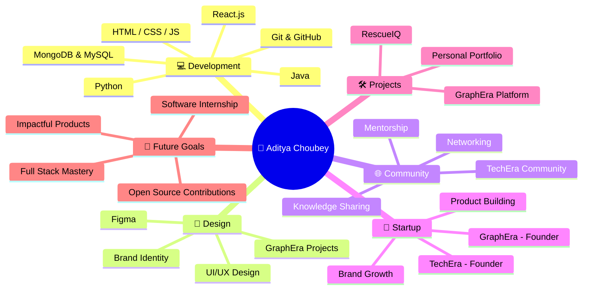

<div align="center">


<br/>


<br/>


</div>

<br/>

<div align="center">
<svg width="100%" height="6" viewBox="0 0 1000 6" xmlns="http://www.w3.org/2000/svg">
  <defs>
    <linearGradient id="g1" x1="0%" y1="0%" x2="100%" y2="0%">
      <stop offset="0%" stop-color="#0D0000"/>
      <stop offset="50%" stop-color="#FF0000"/>
      <stop offset="100%" stop-color="#0D0000"/>
    </linearGradient>
    <filter id="glow1" x="-20%" y="-300%" width="140%" height="700%">
      <feGaussianBlur stdDeviation="3" result="blur"/>
      <feMerge>
        <feMergeNode in="blur"/>
        <feMergeNode in="SourceGraphic"/>
      </feMerge>
    </filter>
  </defs>
  <rect width="1000" height="6" rx="3" fill="url(#g1)" filter="url(#glow1)"/>
</svg>
</div>

<h2 align="center">
<sub></sub>
&nbsp; ABOUT ME &nbsp;
<sub></sub>
</h2>

<table align="center">
<tr>
<td>

```yaml
Name:      Aditya Choubey
Role:      B.Tech IT Student @ ADGIPS (GGSIPU)
Status:    Aspiring Full Stack Developer & Graphic Designer
Founder:   GraphEra | TechEra Community
Mission:   Crafting impactful digital products & growing dev communities
Location:  India 🇮🇳
```

</td>
</tr>
</table>

<div align="center">

🎯 **Currently Focused On:** Mastering Full Stack Development & Building Real-World Products  
🌱 **Currently Learning:** Advanced React, Backend Architecture & System Design  
🤝 **Open To:** Software Internships, Open Source Collaborations & Freelance Design Work  
⚡ **Fun Fact:** I design as much as I code — pixels and code are my playground!

</div>

<br/>

<div align="center">
<svg width="100%" height="6" viewBox="0 0 1000 6" xmlns="http://www.w3.org/2000/svg">
  <defs>
    <linearGradient id="g2" x1="0%" y1="0%" x2="100%" y2="0%">
      <stop offset="0%" stop-color="#0D0000"/>
      <stop offset="50%" stop-color="#FF0000"/>
      <stop offset="100%" stop-color="#0D0000"/>
    </linearGradient>
    <filter id="glow2" x="-20%" y="-300%" width="140%" height="700%">
      <feGaussianBlur stdDeviation="3" result="blur"/>
      <feMerge>
        <feMergeNode in="blur"/>
        <feMergeNode in="SourceGraphic"/>
      </feMerge>
    </filter>
  </defs>
  <rect width="1000" height="6" rx="3" fill="url(#g2)" filter="url(#glow2)"/>
</svg>
</div>

<h2 align="center">
<sub></sub>
&nbsp; MY ECOSYSTEM &nbsp;
<sub></sub>
</h2>



<br/>

<div align="center">
<svg width="100%" height="6" viewBox="0 0 1000 6" xmlns="http://www.w3.org/2000/svg">
  <defs>
    <linearGradient id="g3" x1="0%" y1="0%" x2="100%" y2="0%">
      <stop offset="0%" stop-color="#0D0000"/>
      <stop offset="50%" stop-color="#FF0000"/>
      <stop offset="100%" stop-color="#0D0000"/>
    </linearGradient>
    <filter id="glow3" x="-20%" y="-300%" width="140%" height="700%">
      <feGaussianBlur stdDeviation="3" result="blur"/>
      <feMerge>
        <feMergeNode in="blur"/>
        <feMergeNode in="SourceGraphic"/>
      </feMerge>
    </filter>
  </defs>
  <rect width="1000" height="6" rx="3" fill="url(#g3)" filter="url(#glow3)"/>
</svg>
</div>

<h2 align="center">
<sub></sub>
&nbsp; TECH ARSENAL &nbsp;
<sub></sub>
</h2>

<div align="center">

### 🖥️ Languages & Core


### 🧩 Frameworks & Libraries


### 🗄️ Databases


### 🛠️ Tools & Platforms


</div>

<br/>

<div align="center">
<svg width="100%" height="6" viewBox="0 0 1000 6" xmlns="http://www.w3.org/2000/svg">
  <defs>
    <linearGradient id="g4" x1="0%" y1="0%" x2="100%" y2="0%">
      <stop offset="0%" stop-color="#0D0000"/>
      <stop offset="50%" stop-color="#FF0000"/>
      <stop offset="100%" stop-color="#0D0000"/>
    </linearGradient>
    <filter id="glow4" x="-20%" y="-300%" width="140%" height="700%">
      <feGaussianBlur stdDeviation="3" result="blur"/>
      <feMerge>
        <feMergeNode in="blur"/>
        <feMergeNode in="SourceGraphic"/>
      </feMerge>
    </filter>
  </defs>
  <rect width="1000" height="6" rx="3" fill="url(#g4)" filter="url(#glow4)"/>
</svg>
</div>

<h2 align="center">
<sub></sub>
&nbsp; FEATURED PROJECTS &nbsp;
<sub></sub>
</h2>

<table align="center" width="100%">
<tr>
<td width="50%" valign="top">

### 🆘 RescueIQ
**Emergency Response Platform**

A smart platform built to streamline and accelerate emergency response coordination — connecting people in crisis with the right help, faster.

`React` `JavaScript` `Real-Time Systems`

[](https://github.com/Amritas851203/RescuelQ)

</td>
<td width="50%" valign="top">

### 🌐 Personal Portfolio
**Interactive Developer Portfolio**

A sleek, modern portfolio showcasing my projects, design work, and journey as a developer — built with performance and aesthetics in mind.

`HTML` `CSS` `JavaScript`


</td>
</tr>
<tr>
<td width="50%" valign="top">

### 🎨 GraphEra
**Design & Creative Tech Brand**

The flagship platform of GraphEra — blending graphic design, branding, and tech to deliver creative digital solutions for individuals and businesses.

`Design` `Branding` `Creative Tech`


</td>
<td width="50%" valign="top">

### 🌱 TechEra Community
**Tech Learning & Networking Hub**

A growing community built to help students and developers learn, collaborate, and grow together through shared knowledge and real-world projects.

`Community` `Mentorship` `Growth`


</td>
</tr>
</table>

<br/>

<div align="center">
<svg width="100%" height="6" viewBox="0 0 1000 6" xmlns="http://www.w3.org/2000/svg">
  <defs>
    <linearGradient id="g5" x1="0%" y1="0%" x2="100%" y2="0%">
      <stop offset="0%" stop-color="#0D0000"/>
      <stop offset="50%" stop-color="#FF0000"/>
      <stop offset="100%" stop-color="#0D0000"/>
    </linearGradient>
    <filter id="glow5" x="-20%" y="-300%" width="140%" height="700%">
      <feGaussianBlur stdDeviation="3" result="blur"/>
      <feMerge>
        <feMergeNode in="blur"/>
        <feMergeNode in="SourceGraphic"/>
      </feMerge>
    </filter>
  </defs>
  <rect width="1000" height="6" rx="3" fill="url(#g5)" filter="url(#glow5)"/>
</svg>
</div>

<h2 align="center">
<sub></sub>
&nbsp; ACHIEVEMENTS &nbsp;
<sub></sub>
</h2>

<div align="center">

| 🏅 Achievement | 📌 Description |
|:---|:---|
| 🚀 **Founder — GraphEra** | Built a design-focused creative tech brand from the ground up |
| 🌐 **Founder — TechEra** | Created a thriving tech community for learning & collaboration |
| 💡 **Hackathon Participant** | Collaborated under pressure to build real-world solutions |
| 🎨 **Graphic Designer** | Crafted brand identities, UI designs & visual content |
| 🤝 **Community Builder** | Mentored & connected aspiring developers and designers |
| 🏔️ **Kedarkantha Trek** | Conquered the Himalayan trail — discipline beyond the desk |

</div>

<br/>

<div align="center">
<svg width="100%" height="6" viewBox="0 0 1000 6" xmlns="http://www.w3.org/2000/svg">
  <defs>
    <linearGradient id="g6" x1="0%" y1="0%" x2="100%" y2="0%">
      <stop offset="0%" stop-color="#0D0000"/>
      <stop offset="50%" stop-color="#FF0000"/>
      <stop offset="100%" stop-color="#0D0000"/>
    </linearGradient>
    <filter id="glow6" x="-20%" y="-300%" width="140%" height="700%">
      <feGaussianBlur stdDeviation="3" result="blur"/>
      <feMerge>
        <feMergeNode in="blur"/>
        <feMergeNode in="SourceGraphic"/>
      </feMerge>
    </filter>
  </defs>
  <rect width="1000" height="6" rx="3" fill="url(#g6)" filter="url(#glow6)"/>
</svg>
</div>

<h2 align="center">
<sub></sub>
&nbsp; GITHUB ANALYTICS &nbsp;
<sub></sub>
</h2>

<div align="center">


<br/>


<br/><br/>


</div>

<br/>

<div align="center">
<svg width="100%" height="6" viewBox="0 0 1000 6" xmlns="http://www.w3.org/2000/svg">
  <defs>
    <linearGradient id="g7" x1="0%" y1="0%" x2="100%" y2="0%">
      <stop offset="0%" stop-color="#0D0000"/>
      <stop offset="50%" stop-color="#FF0000"/>
      <stop offset="100%" stop-color="#0D0000"/>
    </linearGradient>
    <filter id="glow7" x="-20%" y="-300%" width="140%" height="700%">
      <feGaussianBlur stdDeviation="3" result="blur"/>
      <feMerge>
        <feMergeNode in="blur"/>
        <feMergeNode in="SourceGraphic"/>
      </feMerge>
    </filter>
  </defs>
  <rect width="1000" height="6" rx="3" fill="url(#g7)" filter="url(#glow7)"/>
</svg>
</div>

<h2 align="center">📊 GITHUB PROFILE STATS</h2>

<p align="center">
  
</p>

<p align="center">
  
  
</p>

<p align="center">
  
  
</p>

