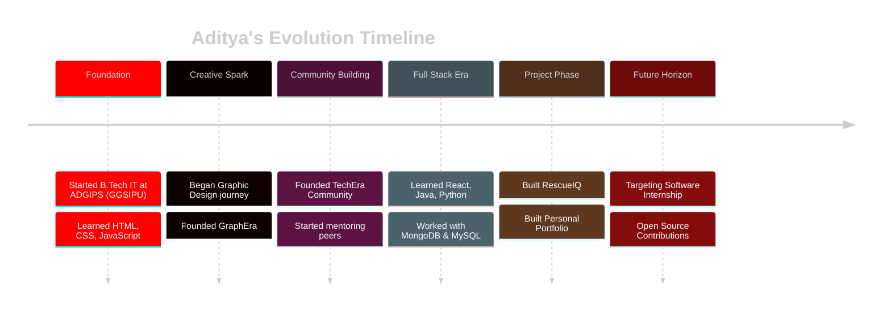
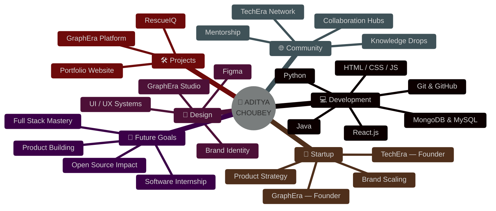

<a name="top"></a>

<div align="center">


<br/>


<br/>


</div>

<p align="center">

</p>

<!-- ================= SECTION 01 — IDENTITY ================= -->

<table width="100%">
<tr><td align="center">

</td></tr>
</table>

<div align="center">

<table>
<tr>
<td width="60%" valign="top">

### 🧬 IDENTITY MATRIX

```yaml
> NAME       : Aditya Choubey
> ROLE       : B.Tech IT Student (ADGIPS, GGSIPU)
> TRACK      : Full Stack Development (MERN-focused)
> CREATIVE   : Graphic Designer / Brand Builder
> VENTURE_01 : Founder @ GraphEra
> VENTURE_02 : Founder @ TechEra
> LOCATION   : India 🇮🇳
> STATUS     : [ ACTIVELY SEEKING INTERNSHIP ]
```

> 💡 *"I don't just write code — I architect digital experiences and build the communities that grow around them."*

</td>
<td width="40%" valign="top" align="center">


</td>
</tr>
</table>

</div>

<p align="center">

</p>

<!-- ================= SECTION 02 — DEVELOPER JOURNEY ================= -->

<div align="center">


</div>



<p align="center">

</p>

<!-- ================= SECTION 03 — ECOSYSTEM ================= -->

<div align="center">


</div>



<p align="center">

</p>

<!-- ================= SECTION 04 — FEATURED PROJECTS ================= -->

<div align="center">


</div>

<table width="100%">
<tr>
<td width="50%" valign="top">

<table width="100%" style="border:1px solid #FF0000;">
<tr><td>

```diff
+ PROJECT_01 :: RESCUEIQ
```

**🆘 Emergency Response Platform**

A real-time coordination system designed to connect people in crisis with rapid emergency assistance — built for speed, clarity, and impact under pressure.

`React` `JavaScript` `Real-Time Architecture`

[](https://github.com/Amritas851203/RescuelQ)

</td></tr>
</table>

</td>
<td width="50%" valign="top">

<table width="100%" style="border:1px solid #FF0000;">
<tr><td>

```diff
+ PROJECT_02 :: PORTFOLIO WEBSITE
```

**🌐 Personal Developer Portfolio**

A sleek, dark-themed personal site engineered to showcase projects, design work, and the journey of a developer-designer hybrid.

`HTML` `CSS` `JavaScript`


</td></tr>
</table>

</td>
</tr>
<tr>
<td width="50%" valign="top">

<table width="100%" style="border:1px solid #FF0000;">
<tr><td>

```diff
+ PROJECT_03 :: GRAPHERA
```

**🎨 Creative Tech Brand**

The flagship product of GraphEra — a fusion of design systems, branding strategy, and technology delivering creative solutions to real clients.

`Design Systems` `Branding` `Creative Tech`


</td></tr>
</table>

</td>
<td width="50%" valign="top">

<table width="100%" style="border:1px solid #FF0000;">
<tr><td>

```diff
+ PROJECT_04 :: NEXT BUILD
```

**🛠️ Open Source / Internship Project**

Slot reserved for the next milestone — a production-grade full stack build, currently in active development as part of an ongoing internship track.

`MERN Stack` `TypeScript` `WebSockets`


</td></tr>
</table>

</td>
</tr>
</table>

<p align="center">

</p>

<!-- ================= SECTION 05 — FOUNDER SECTION ================= -->

<div align="center">


</div>

<table width="100%">
<tr>
<td width="50%" valign="top" align="center">

<table width="100%" style="border:2px solid #FF0000;">
<tr><td align="center">

### 🎨 GRAPHERA
**Design & Creative Technology Brand**
